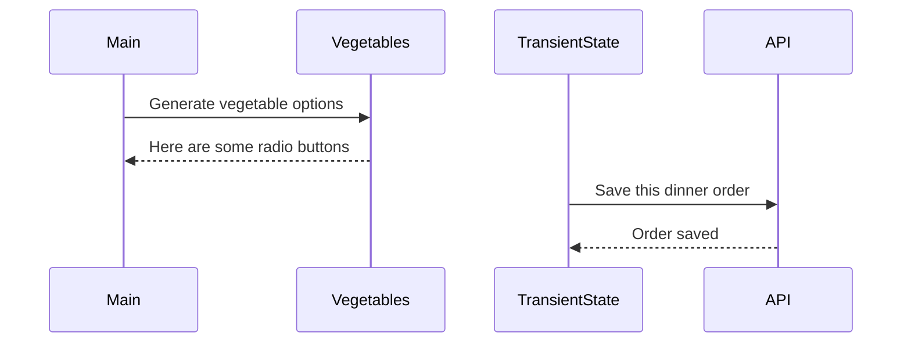

# Events and State Self-Assessment

> 🧨 Make sure you answer the vocabulary and understanding questions at the end of this document before notifying your coaches that you are done with the project

## Setup

1. Make sure you are in your `workspace` directory
1. `git clone {github repo SSH string}`
1. `cd` into the directory it creates
1. `code .` to open the project code
1. Use the `serve` command to start the web server
1. Open the URL provided in Chrome

## Requirements

### Initial Render

1. All 10 base dishes should be displayed as radio input options.
1. All 9 vegetables should be displayed as radio input options.
1. All 6 side dishes should be displayed as radio input options.
1. All previously purchases meals should be displayed below the meal options. Each purchase should display the primary key and the total cost of the purcahsed meal.

### State Management

1. When the user selects an item in any of the three columns, the choice should be stored as transient state.
1. When a user makes a choice for all three kinds of food, and then clicks the "Purchase Combo" button, a new sales object should be...
    1. Stored as permanent state in your local API.
    1. Represented as HTML below the **Monthly Sales** header in the following format **_exactly_**. Your output will not have zeroes, but the actual amount.
        ```html
        Receipt #1 = $00.00
        ```
   1. The user's choices should be cleared from transient state once the purchase is made.

## Design

Given the description and animation above...

1. Create an ERD for this application before you begin.
1. Make a list of what modules need to be created to make your application as modular as possible. Create a **Dependency Graph** for the project to be reviewed once you are complete with the assessment.
1. Create a **Sequence Diagram** that visualizes what your algorithm is for this project. We'll give you a minimal starting point.



## Vocabulary and Understanding

> 🧨 Before you click the "Assessment Complete" button on the Learning Platform, add your answers below for each question and make a commit. It is your option to request a face-to-face meeting with a coach for a vocabulary review.

1. Should transient state be represented in a database diagram? Why, or why not?
   > I don't think the transient state should be represented separate from the purchases table in my ERD. It should have all the same keys (minus the id, which is added by the json-server). It doesn't have any actual relationships with anything else in the database, so it shouldn't be represented in a diagram whose sole purpose is to show relationships between entities.

2. In the **FoodTruck** module, you are **await**ing the invocataion of all of the component functions _(e.g. sales, veggie options, etc.)_. Why must you use the `await` keyword there? Explain what happens if you remove it.
   > The `await` keyword is there because the functions being run are asynchronous--meaning they run int he background rather than sequentially. The computer sees them as a sign to begin an operation, but doesn't wait for that operation to be completed before moving on to the next line of code. That can be a problem if subsequent lines of code depend on the outcomes of those asynchronous operations, as is the case here. In order to create an accurate html string, the **FoodTruck** module needs the result of those fetch requests. Adding the `await` keyword tells the computer that the asynchronous operation needs to be completed before it moves on to the next line of code. If it's removed, the function instead returns an empty promise, which represents the future completion of an asynchronous function. The fetch made a promise that it would be back with the requested data, but the function finished running before that promise was fulfilled. For me, this resulted in the text "[object promise]" being displayed on the webpage rather than the appropriate html. Adding the `await` keyword forces the computer to wait on the return of the promise before continuing to the next line.

3. When the user is making choices by selecting radio buttons, explain how that data is retained so that the **Purchase Combo** button works correctly.
   >First, I have an object called `transientState`, which exists to store the changes a user makes when selecting options from the radio buttons. 
   >I have a listener attached to the document that listens for value changes to input elements. That listener has conditionals that trigger when certain things are true; in this case, if the name of the element experiencing the change is equal to one of our three menu categories. If it is, it triggers my changeFunction() function, which makes changes to the appropriate values in the `transientState` object. E.g., if the user changes their entree selection, it updates the value attached to the 'entree' key in the `transientState` object to match the value of the radio button (whose value has also been mapped to match the appropriate entry in the entrees database).
   >When the **Purchase Combo** button is clicked, it triggers a separate event listener and triggers an event that takes the `transientState` object whose values have been shifted to match the user selections, and posts them to the purchases array in the API. 

4. You used the `map()` array method in the self assessment _(at least, you should have since it is a learning objective)_. Explain why that function is helpful as a replacement for a `for..of` loop.
   > If we were to write a for...of loop, we'd be using it to iterate through an array and concatenate a string using data from each object in that array. The .map() function is already built to iterate through an array and aggregate data from each object within that array. The only limitation is that it returns an array itself. However, when combined with the .join() function, it does exactly what we want with considerably simpler code. .map() is like a more specialized version of a for...of loop. 
   >Right now, my wife is building a fence in our backyard. She could use a shovel to dig the holes for the posts. A shovel is built for digging and it would get the job done. However, there is also a tool called a post hole digger. As its name implies, it's designed to dig post holes. It's a more specific tool for a more specific task. You could get the job done with a shovel, but the post hole digger is more efficient.